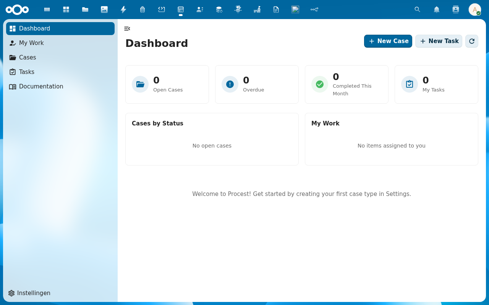
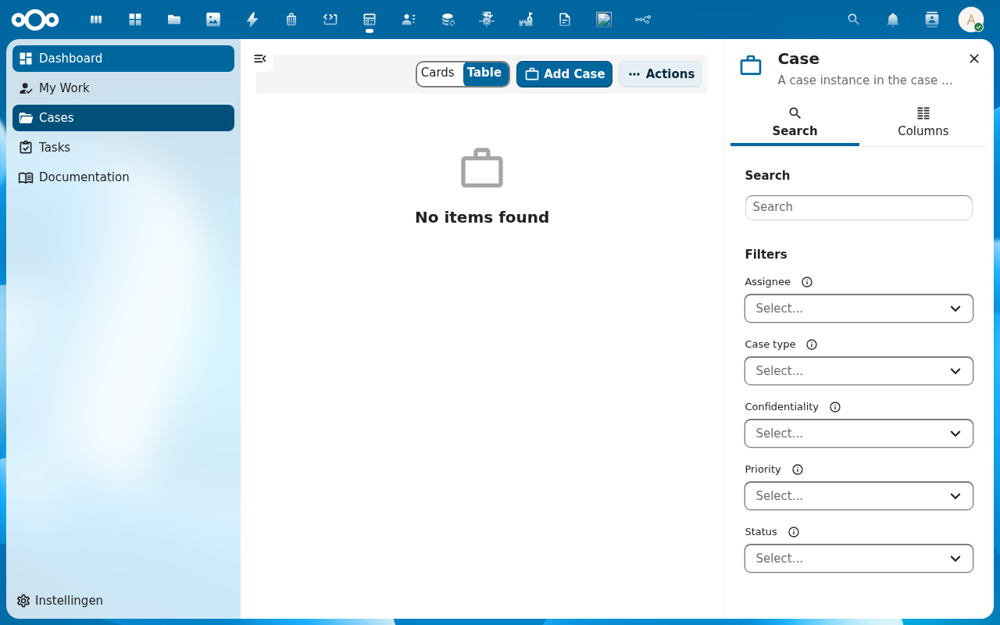
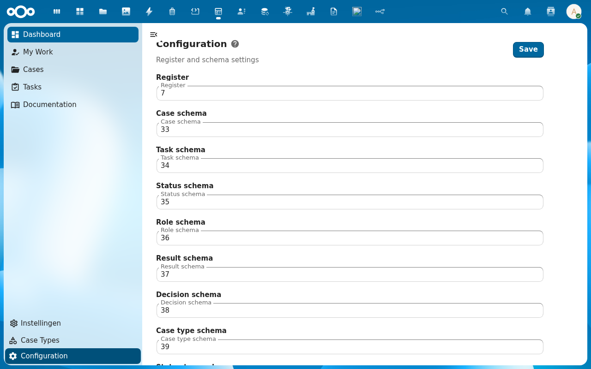
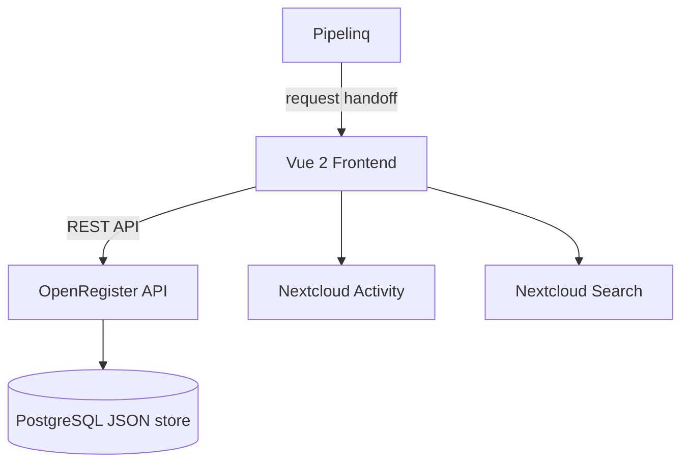

<p align="center">
  
</p>

<h1 align="center">Procest</h1>

<p align="center">
  <strong>Case management for Nextcloud — configurable workflows, deadlines, and formal decisions</strong>
</p>

<p align="center">
  <a href="https://github.com/ConductionNL/procest/releases"></a>
  <a href="https://github.com/ConductionNL/procest/blob/main/LICENSE"></a>
  <a href="https://github.com/ConductionNL/procest/actions"></a>
  <a href="https://procest.app"></a>
</p>

---

Procest brings structured case management (*zaakgericht werken*) natively into Nextcloud. Define case types with custom status lifecycles, track progress and deadlines, assign roles, and record formal decisions — all within a clean, intuitive interface that integrates naturally with the rest of your Nextcloud workspace.

It pairs with [Pipelinq](https://github.com/ConductionNL/pipelinq) to form a complete intake-to-resolution workflow: Pipelinq handles the customer-facing CRM side, Procest handles the internal case processing.

> **Requires:** [OpenRegister](https://github.com/ConductionNL/openregister) — all data is stored as OpenRegister objects (no own database tables).

## Screenshots

<table>
  <tr>
    <td></td>
    <td></td>
    <td></td>
  </tr>
  <tr>
    <td align="center"><em>Dashboard</em></td>
    <td align="center"><em>Cases</em></td>
    <td align="center"><em>Admin — Case Types</em></td>
  </tr>
</table>

## Features

### Case Types
- **Configurable Workflows** — Define case types with allowed statuses, deadline durations, required documents, and custom properties
- **Status Lifecycle** — Design the exact sequence of statuses a case must pass through
- **Default Values** — Set default confidentiality level, assigned roles, and SLA targets per case type
- **Admin Panel** — Manage all case types from a dedicated admin settings view

### Case Management
- **Case Lifecycle** — Full CRUD with status transitions, validation rules, and audit trail
- **Status Timeline** — Visual progress indicator showing all lifecycle phases and current position
- **Automatic Deadlines** — Deadlines calculated from case type duration with live countdown (days remaining / overdue alerts)
- **Quick Status Changes** — Change status directly from the case list without opening the full detail view

### Tasks & Decisions
- **Task Assignment** — Create and assign tasks to team members with BPMN-style lifecycle (available → active → completed)
- **Formal Decisions** — Record official decisions (*besluiten*) with outcomes, motivation, and effective dates
- **Document Checklists** — Track required documents at each status stage with upload verification
- **Participant Roles** — Assign the right people to the right roles: handler, advisor, decision-maker

### Work Management
- **My Work Dashboard** — Personal overview of all assigned cases, pending tasks, and overdue items
- **KPI Cards** — At-a-glance counts of open cases, overdue deadlines, pending tasks, and recent activity
- **Activity Timeline** — Complete history of every change made to a case, with timestamps and responsible party

### Integrations
- **Unified Search** — Deep links for cases and tasks in Nextcloud's global search
- **Pipelinq Bridge** — Receive requests handed off from Pipelinq CRM as new cases
- **Sub-cases** — Break complex cases into parent-child hierarchies for structured processing

## Architecture



### Data Model

| Object | Description | CMMN 1.1 | ZGW Mapping |
|--------|-------------|---------|-------------|
| Case | Formal process with lifecycle | `CasePlanModel` | Zaak |
| Case Type | Configurable case template | `CaseDefinition` | ZaakType |
| Task | Work item within a case | `HumanTask` | — |
| Status | Lifecycle phase | `Milestone` | Status |
| Role | Participant relationship | — | Rol |
| Result | Case outcome | — | Resultaat |
| Decision | Formal decision | — | Besluit |

**Data standard:** CMMN 1.1 (OMG Case Management Model and Notation) with Schema.org mapping and ZGW API compatibility.

### Directory Structure

```
procest/
├── appinfo/           # Nextcloud app manifest, routes, navigation
├── lib/               # PHP backend — controllers, services
├── src/               # Vue 2 frontend — components, Pinia stores, views
│   ├── components/    # Reusable UI components
│   ├── store/         # Pinia stores per entity (cases, caseTypes, tasks…)
│   └── views/         # Route-level views
├── docs/
│   ├── FEATURES.md    # Full feature specification
│   ├── ARCHITECTURE.md
│   └── features/      # Per-feature documentation
├── img/               # App icons and screenshots
├── l10n/              # Translations (en, nl)
└── docusaurus/        # Product documentation site (procest.app)
```

## Requirements

| Dependency | Version |
|-----------|---------|
| Nextcloud | 28 – 33 |
| PHP | 8.1+ |
| [OpenRegister](https://github.com/ConductionNL/openregister) | latest |

## Installation

### From the Nextcloud App Store

1. Go to **Apps** in your Nextcloud instance
2. Search for **Procest**
3. Click **Download and enable**

> OpenRegister must be installed first. [Install OpenRegister →](https://apps.nextcloud.com/apps/openregister)

### From Source

```bash
cd /var/www/html/custom_apps
git clone https://github.com/ConductionNL/procest.git
cd procest
npm install
npm run build
php occ app:enable procest
```

## Development

### Start the environment

```bash
docker compose -f openregister/docker-compose.yml up -d
```

### Frontend development

```bash
cd procest
npm install
npm run dev        # Watch mode
npm run build      # Production build
```

### Code quality

```bash
# PHP
composer phpcs          # Check coding standards
composer cs:fix         # Auto-fix issues
composer phpmd          # Mess detection
composer phpmetrics     # HTML metrics report

# Frontend
npm run lint            # ESLint
npm run stylelint       # CSS linting
```

## Tech Stack

| Layer | Technology |
|-------|-----------|
| Frontend | Vue 2.7, Pinia, @nextcloud/vue |
| Build | Webpack 5, @nextcloud/webpack-vue-config |
| Backend | PHP 8.1+, Nextcloud App Framework |
| Data | OpenRegister (PostgreSQL JSON objects) |
| UX | @conduction/nextcloud-vue |
| Quality | PHPCS, PHPMD, phpmetrics, ESLint, Stylelint |

## Documentation

Full documentation is available at **[procest.app](https://procest.app)**

| Page | Description |
|------|-------------|
| [Features](docs/FEATURES.md) | Complete feature specification |
| [Architecture](docs/ARCHITECTURE.md) | Technical architecture and design decisions |
| [Development](docs/development.md) | Developer setup and contribution guide |

## Standards & Compliance

- **Data standard:** CMMN 1.1 (OMG Case Management specification)
- **Process standards:** BPMN 2.0, DMN for task and decision logic
- **Dutch interoperability:** ZGW APIs (Zaken, Besluiten, Catalogi), RGBZ information model
- **Accessibility:** WCAG AA (Dutch government requirement)
- **Authorization:** RBAC via OpenRegister
- **Audit trail:** Full change history on all objects
- **Localization:** English and Dutch

## Related Apps

- **[Pipelinq](https://github.com/ConductionNL/pipelinq)** — CRM intake; hands off requests to Procest as new cases
- **[OpenRegister](https://github.com/ConductionNL/openregister)** — Object storage layer (required dependency)
- **[OpenCatalogi](https://github.com/ConductionNL/opencatalogi)** — Application catalogue

## License

This project is licensed under the [EUPL-1.2](LICENSE).

### Dependency license policy

All dependencies (PHP and JavaScript) are automatically checked against an approved license allowlist during CI. The following SPDX license families are approved for use in dependencies:

- **Permissive:** MIT, ISC, BSD-2-Clause, BSD-3-Clause, 0BSD, Apache-2.0, Unlicense, CC0-1.0, CC-BY-3.0, CC-BY-4.0, Zlib, BlueOak-1.0.0, Artistic-2.0, BSL-1.0
- **Copyleft (EUPL-compatible):** LGPL-2.0/2.1/3.0, GPL-2.0/3.0, AGPL-3.0, EUPL-1.1/1.2, MPL-2.0
- **Font licenses:** OFL-1.0, OFL-1.1

Dependencies with licenses not on this list will fail CI unless explicitly approved in `.license-overrides.json` with a documented justification.
## Authors

Built by [Conduction](https://conduction.nl) — open-source software for Dutch government and public sector organizations.
